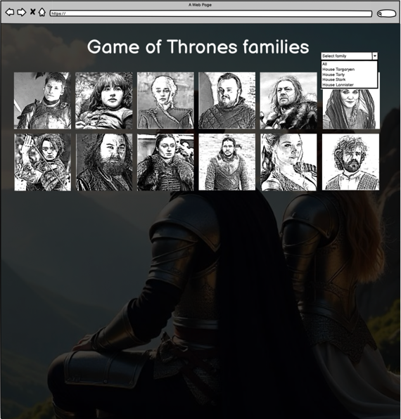
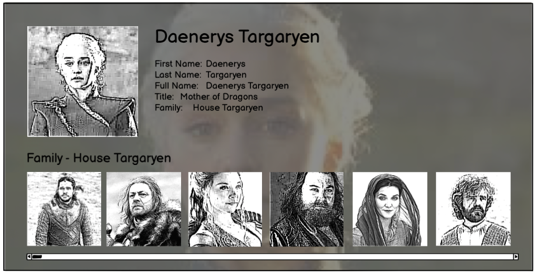
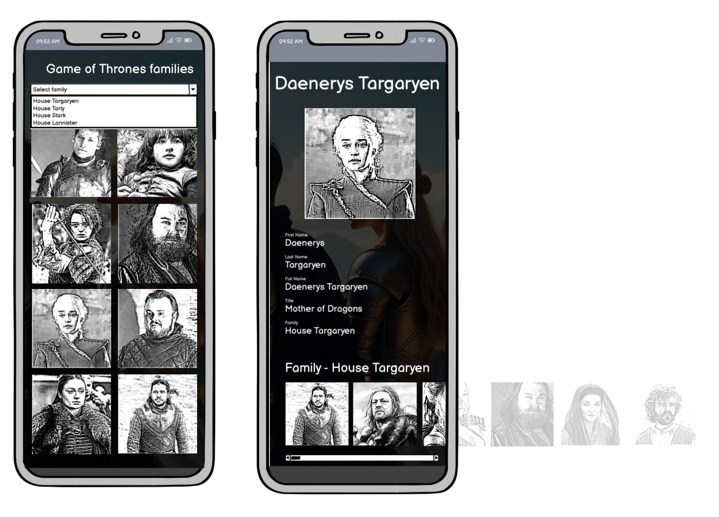

# The Game of Thrones family

A Game of Thrones character and continent information service.

**Overview:**

We are seeking a skilled React developer to build an app to help **Game of Thrones** fans to navigate the family tree of the popular series.

Your task is to build a **"Game of Thrones Family Inspector"** app that fetches and displays information about the different characters and families from the Game of Thrones universe using the [ThronesAPI](https://thronesapi.com/).

## Task Requirements

- The page should be responsive and work on various devices and screen sizes.
- Should be built with ReactJS and should provide an easy way of starting the app locally.
- Main list view
  - Display a list of characters from the Game of Thrones world.
  - Click/tap on any character to view detailed information about that character details and the members of that particular house.
  - It should be possible to filter the main list by family or all characters
- Detailed view
  - Details of the character should be displayed together with the character image.
  - It should be possible to navigate to the main list view from the detailed view.
  - Each house member in the detail view shall be clickable and result in details for that character being presented

Feel free to crop or modify any image or asset for the best result.
The mockup is just an example, feel free to deviate from it and improve the design as long as the requirements are fulfilled.

## Files
You will be provided some early mocks describing the look and feel and also some graphical assets to be used in your app.

<em>Main list view</em>

<em>Detailed view on larger screens</em>

<em>Mobile view</em>

